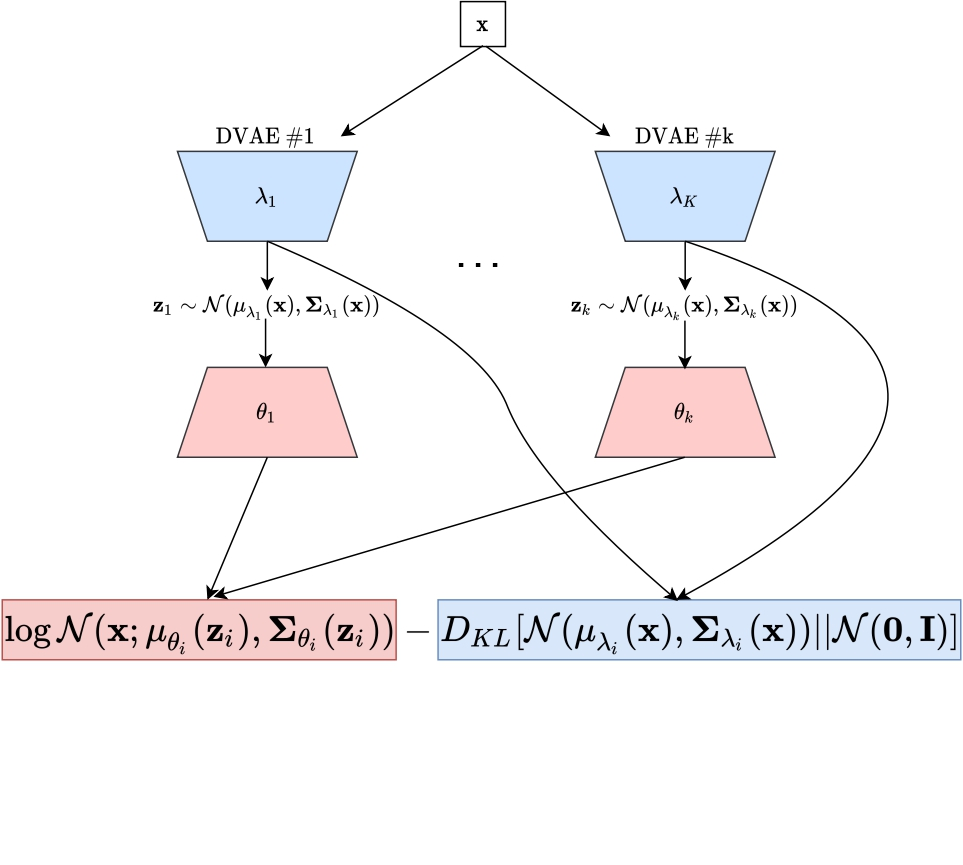

# An Entangled Mixture of Variational Autoencoders Approach to Deep Clustering
This repository includes the accompanying code for the paper "[An Entangled Mixture of Variational Autoencoders Approach to Deep Clustering](https://openreview.net/pdf?id=LpSGtq6F5xN)". Avi Caciularu and Jacob Goldberger.

<p align="center"></p>


We heavily relied on the code from the [K-Autoencoders Deep Clustering](https://github.com/yanivopo/K-DAE) repository.
3
The instructions are based on the [K-Autoencoders Deep Clustering](https://github.com/yanivopo/K-DAE) repository, and are modified to support our version.


#### How to Use?
* Clone this repository.
* cd to the cloned dir 
* run `conda create -n k_dae python=3.6`
* run `conda activate k_dvae`
* run `pip install -r path\to\requirements.txt`


#### Run Example: 
* `python main.py -dn mnist` 

#### Optional Args: 

* `--dataset_name` - The name of dataset [mnist / fashion / usps] default: mnist
* `--save_dir` - path to output folder. (contains logs and model.)

#### Contact
For additional data or code please contact [Avi Caciularu](https://aviclu.github.io/).


### Citation
If you find our work useful, please cite the paper as:
```bibtex
@article{caciularu2022entangledmixture,
      title={An Entangled Mixture of Variational Autoencoders Approach to Deep Clustering},
      author={Caciularu, Avi and Goldberger, Jacob},
      journal={Neurocomputing},
      year={2023},
}
```